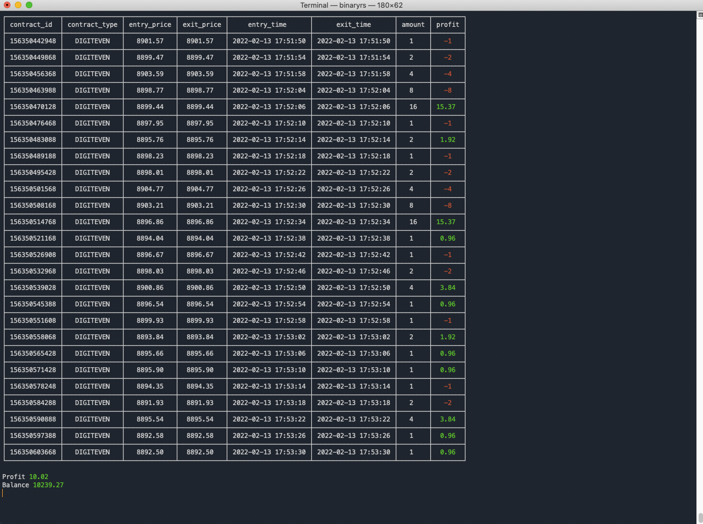

# Binaryrs

Trading bot for Binary.com done in Rust

## Run

You need to obtain your `token` and `app` values from your account over at binary.com
```bash
cargo run -- --token=XXXXXXXX --app=XXXXX --duration=1 --amount=1 --profit=10 --stop=4 --contract=digiteven
```
`Options`
`--duration=1` That is the number of ticks to wait between trades
`--amount=1`   Amount of dollars on each trade
`--profit=10`  Profit to take and close the trading session
`--stop=4`     Stop loss, trading session will end at the specified consecutive loss
`--contract=digiteven` Type of contract to trade `digiteven`, `digitodd` and `both` ( `both` will alternate between `digiteven` and `digitodd`)

To exit a trading session you must hit `CTRL` + `C` to end the program.

## Screenshots

Example of a trading session



## Contributing

1. Fork it (<https://github.com/xtokio/binaryrs/fork>)
2. Create your feature branch (`git checkout -b my-new-feature`)
3. Commit your changes (`git commit -am 'Add some feature'`)
4. Push to the branch (`git push origin my-new-feature`)
5. Create a new Pull Request

## Contributors

- [Luis Gomez](https://github.com/xtokio) - creator and maintainer
